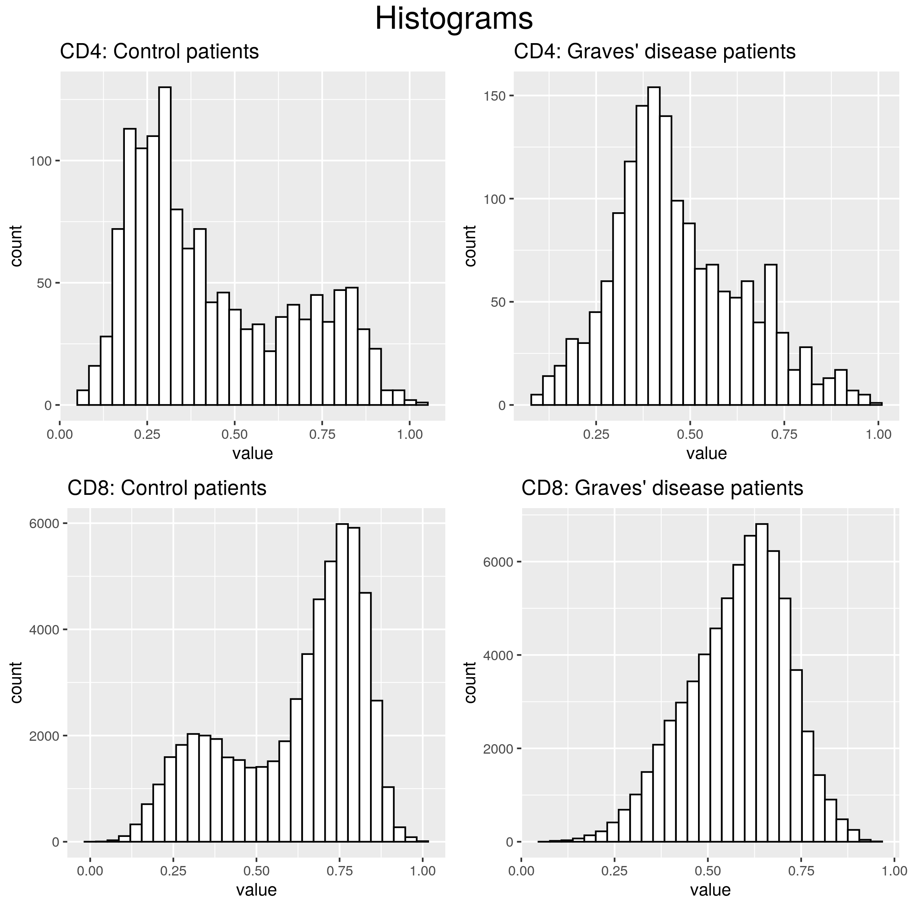
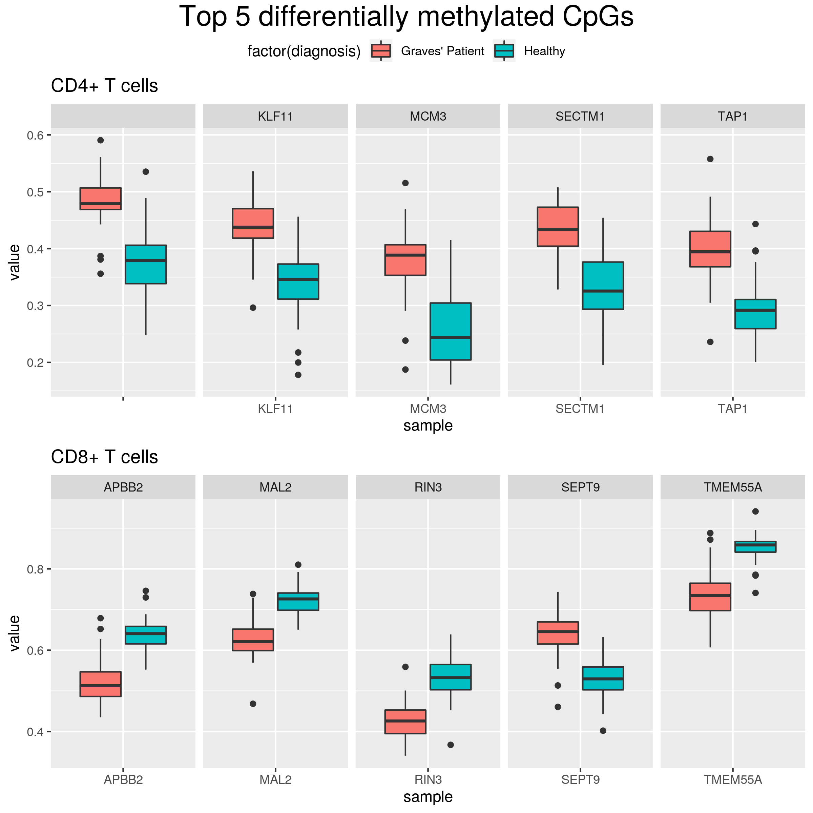
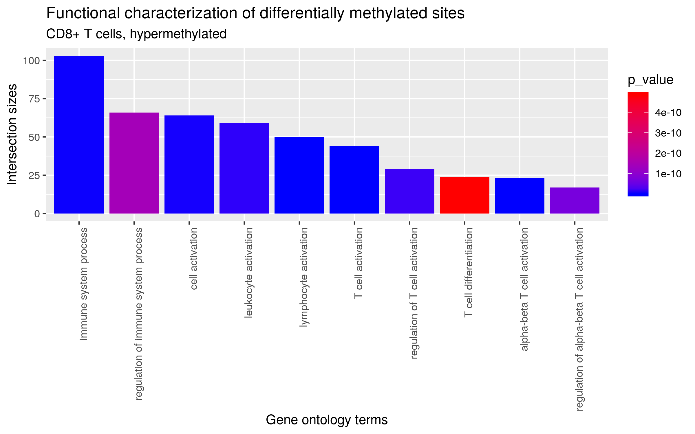
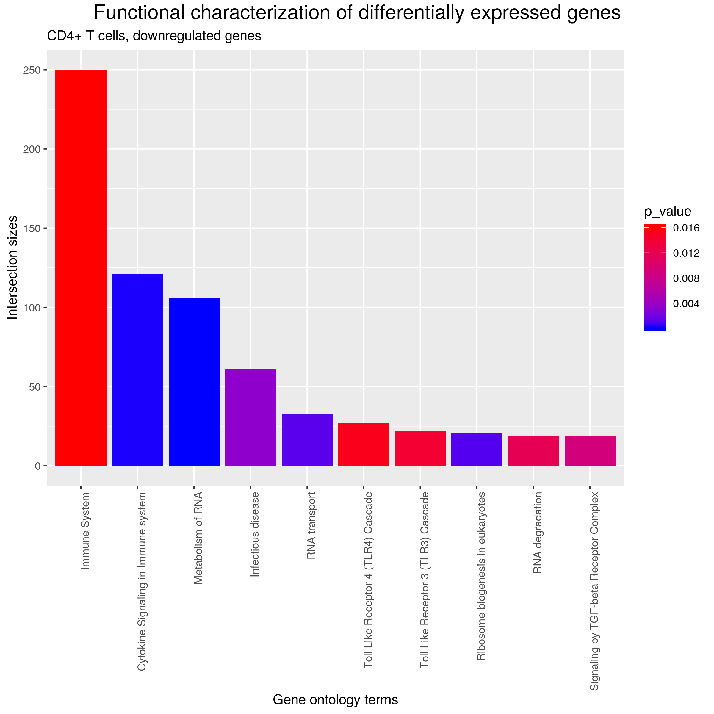

# Abstract

Graves' disease (GD) is an autoimmune thyroid disease defined by the production of stimulating autoantibodies to the thyroid-stimulating hormone receptor (TSHR) that induce a sustained state of hyperthyroidism in patients. Increasing evidence suggests that epigenetic modifications play a substantial role in the pathogenesis of Graves' disease. To identify the epigenetic changes involved in GD, a genome-wide analysis of DNA methylation was performed in sorted CD4+ and CD8+ T cells. The analysis identified 44 and 1861  differentially methylated CpG sites in CD4+ and CD8+ T cells, respectively. The functional analysis showed an involvement of dysregulated DNA methylation in T cell activation, differentiation and signaling in GD patients. 

# Introduction

Graves' disease (GD) is an autoimunne disease affecting the thyroid. The disorder results from an antibody, called thyroid-stimulating immunoglobulin (TSI) mimicing the action of the thyroid stimulating hormone (TSH). TSI antibodies along with other autoantibodies cause uncontrolled production of thyroid hormone and hypertheroidism.

The ethymology of GD is complex; a combination of genetic, epigenetic and environmental factors contribute to the development of the disease. T cells play an important role in Graves' disease as they influence the production of thyroid-stimulating antibodies. Circulating T-cells, in particular CD4+ and CD8+ cells, infiltrate the thyroid and recognize epitopes on the thyroid stimulation hormone receptor (TSHR). 

It has been suggested that environmental factors could be influencing the performance of T cells through epigenetic modulations, in particular DNA hypermethylation. The disruption of T cell signaling and activation could contribute to GD onset and progression. 

To identify the epigenetic changes involced in GD, a genome-wide analysis of DNA methylation was performed along with gene expression measurements in sorted CD4+ and CD8+ T cells.

# Methods

## Dataset

The DNA methylation and gene expression datasets used was published by Limbach et al. (2015) and downloaded from GEO repository with accession number *GSE71957*.

The study was carried among 69 female participant (GD is more prevalent in woman): 38 with past diagnosis of GD and 31 healthy individuals. The CD4+ and CD8+ cells were purified from blood and gene expression was measured with HumanHT-12 v4 Expression BeadChips. DNA methylation analysis was perfomed using Infinium Human Methylation450 BeadChip (Illumina).

Throughout the entire analysis the CD4+ T cells and CD8+ T cells datasets were considered and analysed separately both in methylation and expression datasets.

## Preprocessing of methylation data 

The initial data cleanining was performed by the authors at the raw files stage. The probes with a detection p-value >0.01 were removed and resulting β intensity values were normalized with stratified quantile normalization within seperate subsets for CD4+ and CD8+ cells, as described in the paper.

Subsequently, the SNP-containing probes were removed from the dataset. After filtering, 328385 of CpG probes were kept in both  CD4+ and CD8+ datasets.

The missing values were filled with *imputePCA* method. In this method the missing entries are imputed of a mixed data using the low-rank approximation version of the iterative PCA (Principal Component Analysis) algorithm, also known as EM-PCA. 

## Differential methylation analysis

The methylation values of each CpG site were corrected by using a *ComBat* linear model with age as covariate. The model residuals were used for differential methylation analysis with the R package *seqlm*. Single CpGs with a false discovery rate (FDR) < 0.005 and an absolute methylation difference of >0.1 were considered as differentially methylated. 

## Preprocessing of expression data 

As previously, the preprocessing steps and quality control of the datasets were performed by the authors directly on the IDAT files of the expression arrays using the Bioconductor package *limma*. The low quality samples were removed.  

## Differential expression analysis

The remaining expression arrays were corrected with *ComBat* as previously. In order to identify differentially expressed genes between healthy controls and GD patients a linear regression model was constructed with *limma* package. Genes with the FDR adjusted p-value <0.1 and a log fold change >0.176 were considered to be differentially expressed.

## Functional enrichment analysis

The functional enrichment analysis was performed with *gProfilerR*. The genes associated with differentially methylated CpG sited and differentialy expressed genes were queried for enriched GO ontology terms, the KEGG pathways, the REACTOME database, CORUM protein complexes, miRBase and TRANSFAC regulatory motifs. The results of the analysis was visualized with custom plots in *ggplot2*.   

# Results

## GD-associated DNA methylation in CD4+ and CD8+ T cells

The analysis identified 44 and 1861 CpG sites as differentially methylated between patient and control individuals in CD4+ and CD8+ T cells, respectively, of which 32 were found in both subsets. 

By looking at the histograms (Fig 1.) one can see that CD8+ T cell subset have overabundance of CpGs in range 0.0-0.5 compared to the control group, suggesting a number of hypomethylated CpGs. The precise numbers of hypomethylated and hypermethylated CpGs (1293 and 568, respectively) are in accordance with this observation. The proportion of hypomethylated CpGs in CD8+ cells (0.69) is larger than in CD4+ T cells (0.32). GD patients have more hypomethylated CpGs in their CD8+ T cells.

*Figure 1. Histograms of methylation intensity values in CD8+ and CD8+ cells showing differences between control and Graves' disease patients.*

The majority of the top five significantly changed CpGs (Fig 2.) are related to general cellular processes, however often associated with the transmembrane transport. An outstanding example would be SECTM1 gene encoding a transmembrane secreted protein, which is thought to be involved in hematopoietic and/or immune system processes.

*Figure 2.  Methylation levels of the top differentially methylated CpG sites in CD4+ and CD8+ T cells from patients and controls.*

## Functional analysis

The gene ontology (GO) analysis for biological process terms using g:Profiler revelead enrichment of T cell activation and signaling among genes associated with hypermethylated sites in CD8+ cells (Fig. 3). The hypermethylated genes are also enriched with general terms related to innate immune processes. The hypomethylated genes in CD8+ and both hypo- and hypermethylated genes in CD4+ were associated with general cellular processes. 

*Figure 3. Functional characterization of differentially methylated sites. Top 10 Gene Ontology terms related to the downregulated genes in CD4+ cells.*

## Expression profiling in GD patients

The differential expression analysis identified all of the genes in both groups as downregulated, with 2909 and 5118 genes in CD4+ and CD9+ T cells subsets, respectively. As much as 584 genes are shared between the subsets. 

The interlap between genes associated with differently methylated CpG sites and differentially expressed genes in CD4+ cells is 5, while for CD8+ cells it is 80. 

The gene ontology analysis of genes in CD4+ T cells reveals similar enrichment pattern as in case of hypermethylated CpGs of CD8+ T cells (Fig. 4). The CD8+ T cells functional characteristics are once again related to the general cell processes. 

*Figure 4. Functional characterization of differentially expressed genes. Top 10 Gene Ontology terms related to the most differentially*

# Discussion

Genome-wide analysis of DNA methylation along with the functional enrichment analysis indicate a relationship between DNA methylation and T cell function in Graves' disease patients. A special attention should be paid to hypermethylated genes in CD8+ T cells which reveal enrichment of T cell activation, differentation, singaling and general immune processes. Dysregulated DNA methylation downregulates the differentially expressed genes between patient and control individuals in CD4+ and CD8+ T cells.

However, the obtained results significantl vary from the ones published in the original paper. The differences include a smaller number of differentially methylated CpGs found and different results of functional analysis. 

One of the causes of this discrepancy could be the criteria for differenly methylated CpG sites. While the authors used a false discovery rate (FDR) < 0.005 and an absolute methylation difference of >0.5, it was impossible to preserve this requirement and instead a methylation difference of >0.1 was used. Even with this relaxed criterion a much smaller number of differentially methylated CpG sites was obtained. 
Another reason could be a very vague and imprecise describtion of the analysis steps, what left a lot of space for the interpretation.The reproducibility of this paper could be greatly improved if the authors decided to publish the code. 

The follow-up for this work should involve integration of ChIP-seq study with results of genome-wide methylation profiling. 

# References

1. M. Limbach, et al., Epigenetic profiling in CD4+ and CD8+ T cells from Graves' disease patients reveals changesm in genes associated with T cell receptor signaling, Journal of Autoimmunity (2015), http://dx.doi.org/10.1016/j.jaut.2015.09.006

2. M Ritchie et al., limma powers differential expression analyses for RNA-sequencing and microarray studies., Nucleic Acids Research (2015), 43(7), e47. doi: 10.1093/nar/gkv007.

3. R. Kolde et al., Seqlm: an MDL Based Method for Identifying Differentially Methylated Regions in High Density Methylation Array Data Bioinformatics (2016) (Oxford, England): btw304.

4. U. Raudvere et al. g:Profiler: a web server for functional enrichment analysis and conversions of gene lists (2019 update) Nucleic Acids Research 2019; doi:10.1093/nar/gkz369
